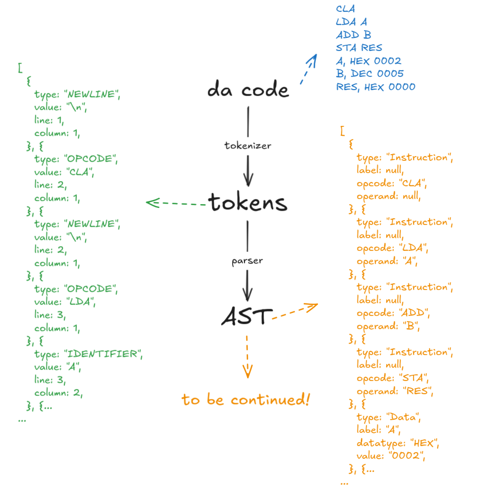

## The plan



## Grammer

```
program      → line* EOF
line         → statement NEWLINE
statement    → instruction | labelDecl
instruction  → OPCODE operand?
labelDecl    → IDENTIFIER COMMA (instruction | dataDecl)
dataDecl     → DATATYPE NUMBER
operand      → IDENTIFIER | NUMBER
```
