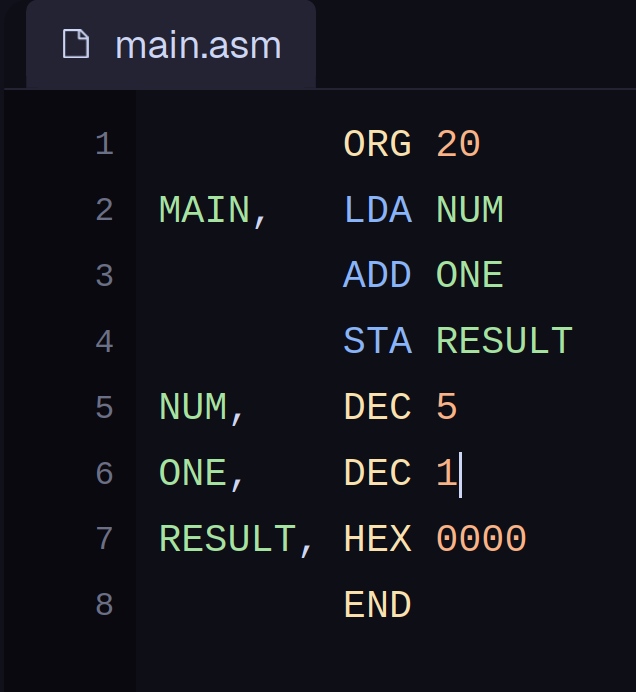
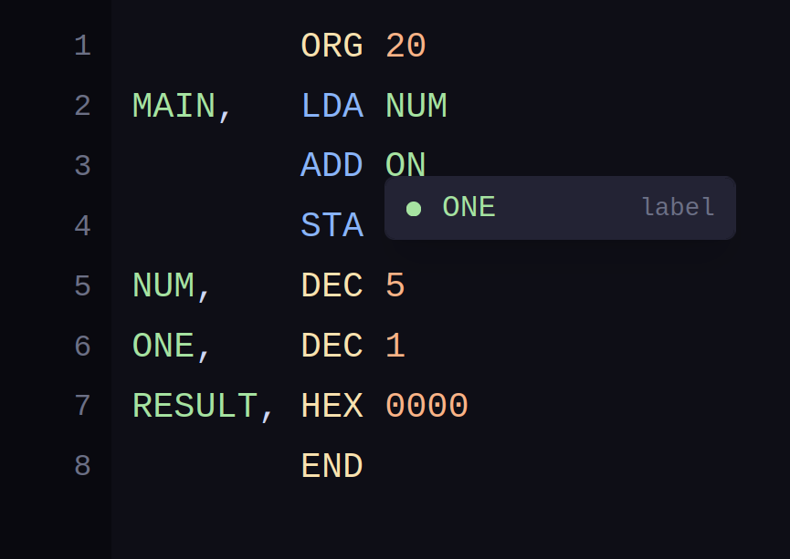
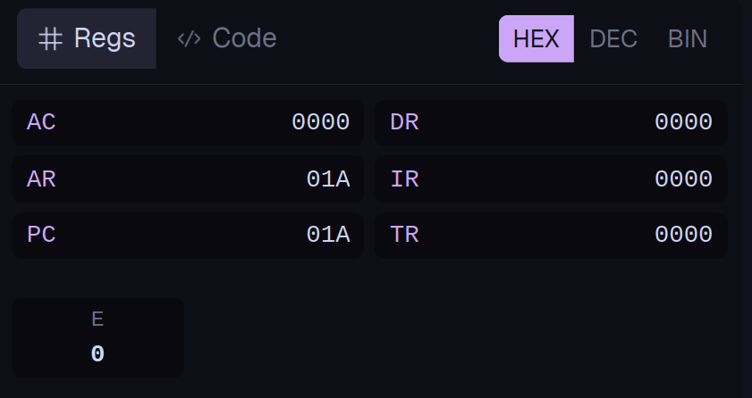
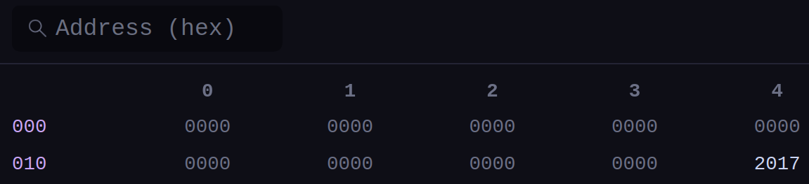
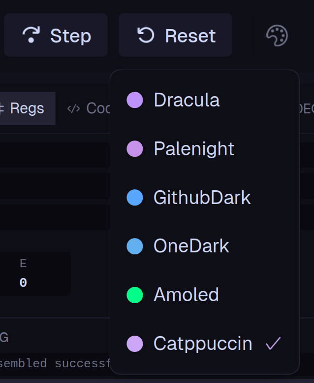
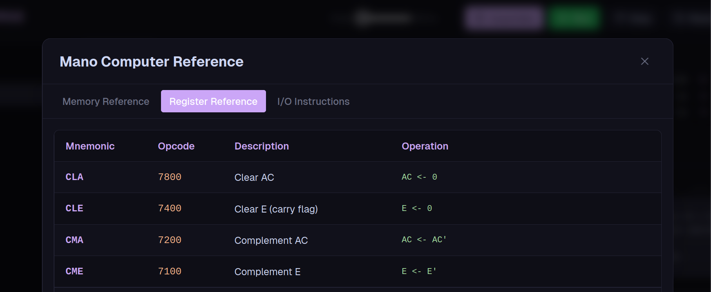
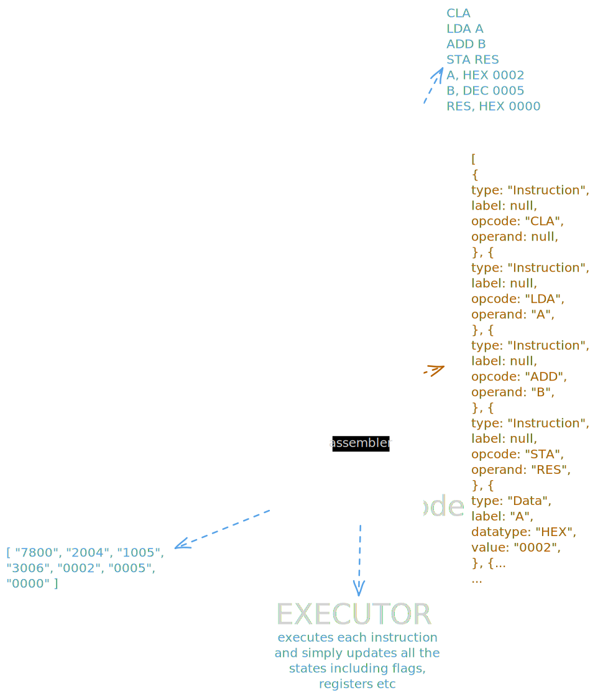

<div style="display: flex; justify-content: center; margin: 20px 0; color: #ffffff;">
  
</div>
<div style="text-align: center; margin-bottom: 20px; color: #ffffff;">
<h1 style="font-size: 2.5em; margin: 0;">Mano Forge</h1>
<p style="font-size: 1.2em; margin: 5px 0;">A simulator based on Morris Mano's basic architecture of a computer!</p>
</div>

---

## Features

<table>
<tr>
<td width="50%" valign="top">

**1. Code editor with sexy syntax highlighting!**



</td>
<td width="50%" valign="top">

**2. Save your programs (even though its in local memeory hehe)**


</td>
</tr>
<tr>
<td width="50%" valign="top">

**3. Get suggestions as you type, gives you hints ya!**



</td>
<td width="50%" valign="top">

**4. Controll literally everything about the simulation**


</td>
</tr>
<tr>
<td width="50%" valign="top">

**5. Check the states of all registers and E ofcourse how can i forget that**



</td>
<td width="50%" valign="top">

**6. Full huge memory, without even a single performance issue**



</td>
</tr>
<tr>
<td width="50%" valign="top">

**7. Ofcourse, themes so you dont get bored (i need more themes pleeeeeasseeee consider contributing)**



</td>
<td width="50%" valign="top">

**8. Just in case your brilliant mind ever gets stuck, docs**



</td>
</tr>
</table>

---

## The plan, now complete :)

<div style="display: flex; justify-content: center; margin: 20px 0;">

</div>

---

## The grammar of the assembly language is as follows:

```
program      → line* EOF
line         → statement NEWLINE
statement    → instruction | labelDecl
instruction  → OPCODE operand?
labelDecl    → IDENTIFIER COMMA (instruction | dataDecl)
dataDecl     → DATATYPE NUMBER
operand      → IDENTIFIER | NUMBER
```

### Dedicated to a genius, Morris Mano, the guy who made me fall in love with literal architectures, and my teacher, Prof. Zishan Noorani!
