<div align="center">
  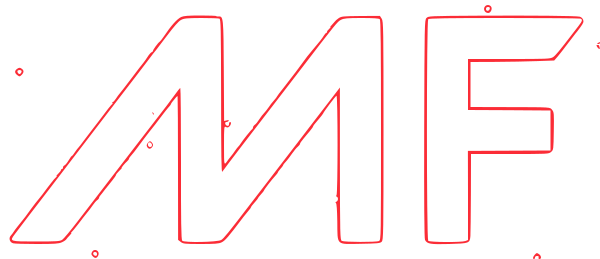
  <h1>Mano Forge</h1>
  <p>A simulator based on Morris Mano's basic architecture of a computer!</p>
</div>

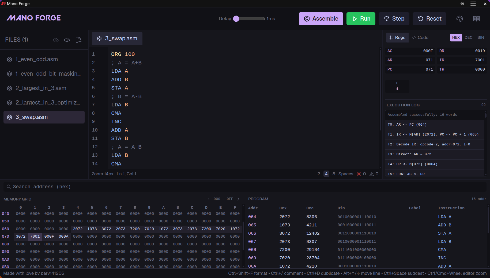

## Features

<table>
<tr>
<td width="50%" valign="top">

**1. Code editor with sexy syntax highlighting!**

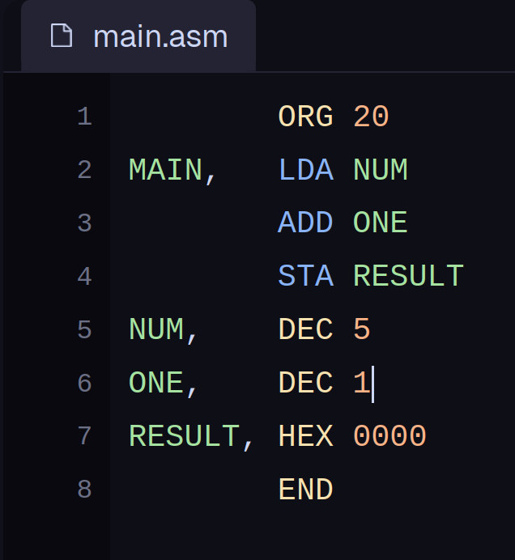

</td>
<td width="50%" valign="top">

**2. Save your programs (even though its in local memeory hehe)**

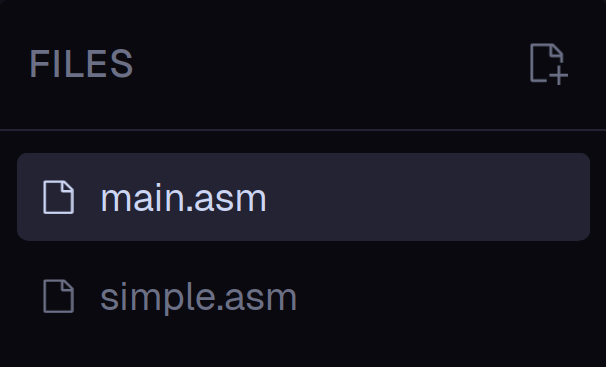

</td>
</tr>
<tr>
<td width="50%" valign="top">

**3. Get suggestions as you type, gives you hints ya!**

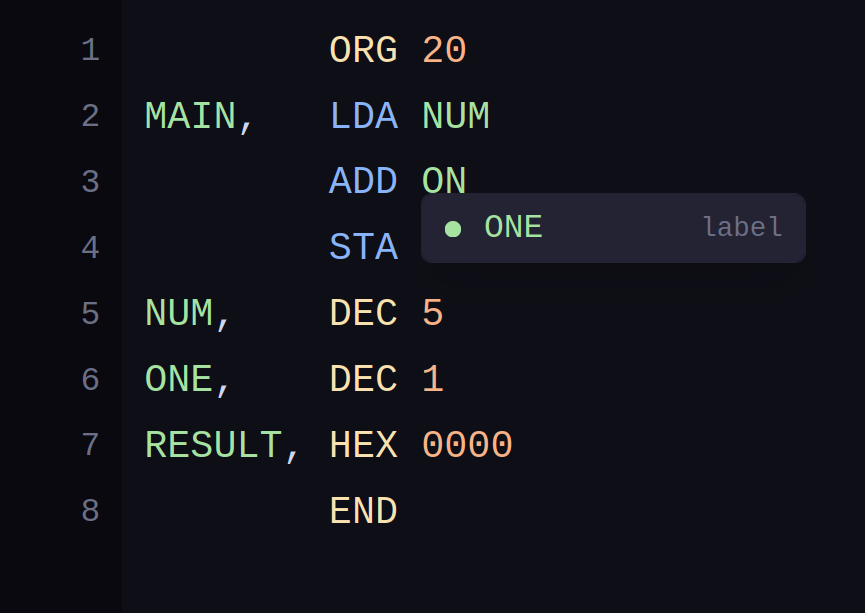

</td>
<td width="50%" valign="top">

**4. Controll literally everything about the simulation**

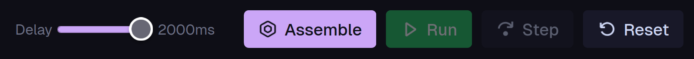

</td>
</tr>
<tr>
<td width="50%" valign="top">

**5. Check the states of all registers and E ofcourse how can i forget that**

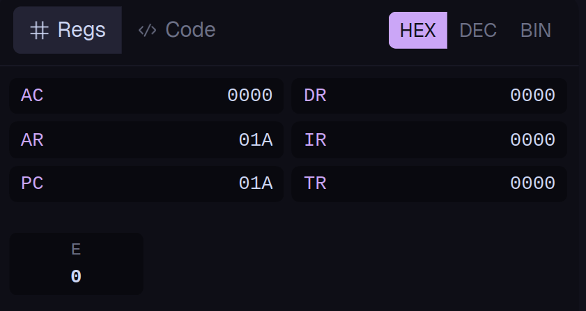

</td>
<td width="50%" valign="top">

**6. Full huge memory, without even a single performance issue**

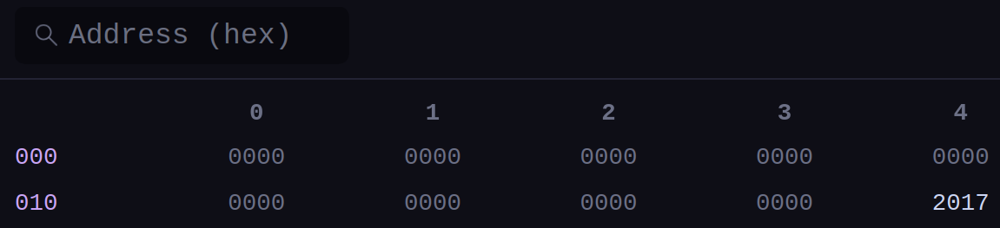

</td>
</tr>
<tr>
<td width="50%" valign="top">

**7. Ofcourse, themes so you dont get bored (i need more themes pleeeeeasseeee consider contributing)**

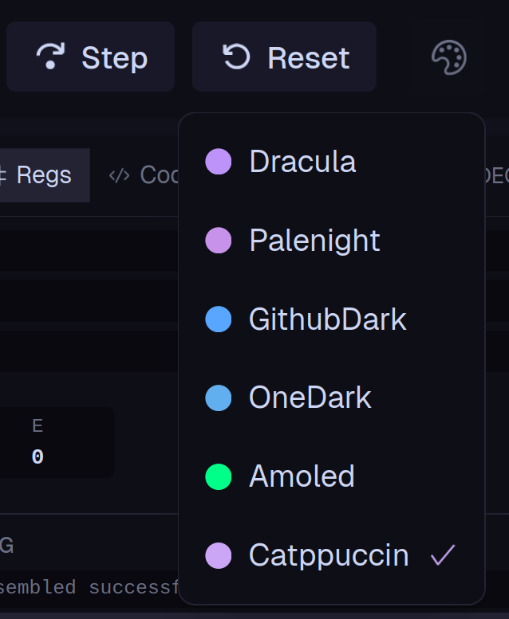

</td>
<td width="50%" valign="top">

**8. Just in case your brilliant mind ever gets stuck, docs**

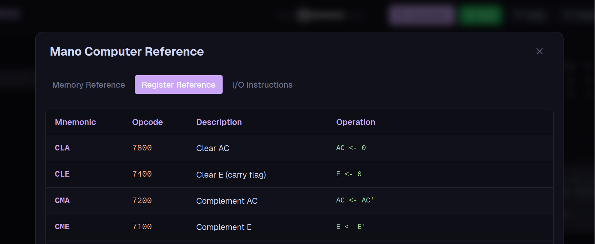

</td>
</tr>
</table>

---

## Theme drip and font swag 😎

Not just options. Full wardrobe change.

### 🎨 Color schemes currently in Mano Forge

<table>
<tr>
<th align="left">Scheme</th>
<th align="left">Palette preview (single line drip)</th>
</tr>
<tr><td>Dracula</td><td><span style="display:inline-block;width:12px;height:12px;background:#bd93f9;border-radius:2px;margin-right:4px;"></span><span style="display:inline-block;width:12px;height:12px;background:#ff79c6;border-radius:2px;margin-right:4px;"></span><span style="display:inline-block;width:12px;height:12px;background:#8be9fd;border-radius:2px;margin-right:4px;"></span><span style="display:inline-block;width:12px;height:12px;background:#50fa7b;border-radius:2px;margin-right:4px;"></span><span style="display:inline-block;width:12px;height:12px;background:#ffb86c;border-radius:2px;"></span></td></tr>
<tr><td>Palenight</td><td><span style="display:inline-block;width:12px;height:12px;background:#c792ea;border-radius:2px;margin-right:4px;"></span><span style="display:inline-block;width:12px;height:12px;background:#82aaff;border-radius:2px;margin-right:4px;"></span><span style="display:inline-block;width:12px;height:12px;background:#c3e88d;border-radius:2px;margin-right:4px;"></span><span style="display:inline-block;width:12px;height:12px;background:#f78c6c;border-radius:2px;margin-right:4px;"></span><span style="display:inline-block;width:12px;height:12px;background:#ffcb6b;border-radius:2px;"></span></td></tr>
<tr><td>Github Dark</td><td><span style="display:inline-block;width:12px;height:12px;background:#58a6ff;border-radius:2px;margin-right:4px;"></span><span style="display:inline-block;width:12px;height:12px;background:#ff7b72;border-radius:2px;margin-right:4px;"></span><span style="display:inline-block;width:12px;height:12px;background:#7ee787;border-radius:2px;margin-right:4px;"></span><span style="display:inline-block;width:12px;height:12px;background:#ffa657;border-radius:2px;margin-right:4px;"></span><span style="display:inline-block;width:12px;height:12px;background:#c9d1d9;border-radius:2px;"></span></td></tr>
<tr><td>One Dark</td><td><span style="display:inline-block;width:12px;height:12px;background:#c678dd;border-radius:2px;margin-right:4px;"></span><span style="display:inline-block;width:12px;height:12px;background:#61afef;border-radius:2px;margin-right:4px;"></span><span style="display:inline-block;width:12px;height:12px;background:#98c379;border-radius:2px;margin-right:4px;"></span><span style="display:inline-block;width:12px;height:12px;background:#d19a66;border-radius:2px;margin-right:4px;"></span><span style="display:inline-block;width:12px;height:12px;background:#e5c07b;border-radius:2px;"></span></td></tr>
<tr><td>Amoled</td><td><span style="display:inline-block;width:12px;height:12px;background:#00ff88;border-radius:2px;margin-right:4px;"></span><span style="display:inline-block;width:12px;height:12px;background:#ff6b9d;border-radius:2px;margin-right:4px;"></span><span style="display:inline-block;width:12px;height:12px;background:#ffcc00;border-radius:2px;margin-right:4px;"></span><span style="display:inline-block;width:12px;height:12px;background:#00bfff;border-radius:2px;margin-right:4px;"></span><span style="display:inline-block;width:12px;height:12px;background:#ff9500;border-radius:2px;"></span></td></tr>
<tr><td>Catppuccin</td><td><span style="display:inline-block;width:12px;height:12px;background:#cba6f7;border-radius:2px;margin-right:4px;"></span><span style="display:inline-block;width:12px;height:12px;background:#89b4fa;border-radius:2px;margin-right:4px;"></span><span style="display:inline-block;width:12px;height:12px;background:#a6e3a1;border-radius:2px;margin-right:4px;"></span><span style="display:inline-block;width:12px;height:12px;background:#fab387;border-radius:2px;margin-right:4px;"></span><span style="display:inline-block;width:12px;height:12px;background:#f9e2af;border-radius:2px;"></span></td></tr>
<tr><td>Rose Pine</td><td><span style="display:inline-block;width:12px;height:12px;background:#eb6f92;border-radius:2px;margin-right:4px;"></span><span style="display:inline-block;width:12px;height:12px;background:#9ccfd8;border-radius:2px;margin-right:4px;"></span><span style="display:inline-block;width:12px;height:12px;background:#f6c177;border-radius:2px;margin-right:4px;"></span><span style="display:inline-block;width:12px;height:12px;background:#c4a7e7;border-radius:2px;margin-right:4px;"></span><span style="display:inline-block;width:12px;height:12px;background:#31748f;border-radius:2px;"></span></td></tr>
<tr><td>Nord</td><td><span style="display:inline-block;width:12px;height:12px;background:#88c0d0;border-radius:2px;margin-right:4px;"></span><span style="display:inline-block;width:12px;height:12px;background:#b48ead;border-radius:2px;margin-right:4px;"></span><span style="display:inline-block;width:12px;height:12px;background:#a3be8c;border-radius:2px;margin-right:4px;"></span><span style="display:inline-block;width:12px;height:12px;background:#d08770;border-radius:2px;margin-right:4px;"></span><span style="display:inline-block;width:12px;height:12px;background:#ebcb8b;border-radius:2px;"></span></td></tr>
<tr><td>Gruvbox</td><td><span style="display:inline-block;width:12px;height:12px;background:#fe8019;border-radius:2px;margin-right:4px;"></span><span style="display:inline-block;width:12px;height:12px;background:#fb4934;border-radius:2px;margin-right:4px;"></span><span style="display:inline-block;width:12px;height:12px;background:#b8bb26;border-radius:2px;margin-right:4px;"></span><span style="display:inline-block;width:12px;height:12px;background:#d3869b;border-radius:2px;margin-right:4px;"></span><span style="display:inline-block;width:12px;height:12px;background:#fabd2f;border-radius:2px;"></span></td></tr>
<tr><td>Tokyo Night</td><td><span style="display:inline-block;width:12px;height:12px;background:#7aa2f7;border-radius:2px;margin-right:4px;"></span><span style="display:inline-block;width:12px;height:12px;background:#bb9af7;border-radius:2px;margin-right:4px;"></span><span style="display:inline-block;width:12px;height:12px;background:#9ece6a;border-radius:2px;margin-right:4px;"></span><span style="display:inline-block;width:12px;height:12px;background:#ff9e64;border-radius:2px;margin-right:4px;"></span><span style="display:inline-block;width:12px;height:12px;background:#e0af68;border-radius:2px;"></span></td></tr>
<tr><td>Everforest</td><td><span style="display:inline-block;width:12px;height:12px;background:#a7c080;border-radius:2px;margin-right:4px;"></span><span style="display:inline-block;width:12px;height:12px;background:#e67e80;border-radius:2px;margin-right:4px;"></span><span style="display:inline-block;width:12px;height:12px;background:#7fbbb3;border-radius:2px;margin-right:4px;"></span><span style="display:inline-block;width:12px;height:12px;background:#d699b6;border-radius:2px;margin-right:4px;"></span><span style="display:inline-block;width:12px;height:12px;background:#dbbc7f;border-radius:2px;"></span></td></tr>
<tr><td>Material Ocean</td><td><span style="display:inline-block;width:12px;height:12px;background:#82aaff;border-radius:2px;margin-right:4px;"></span><span style="display:inline-block;width:12px;height:12px;background:#c792ea;border-radius:2px;margin-right:4px;"></span><span style="display:inline-block;width:12px;height:12px;background:#c3e88d;border-radius:2px;margin-right:4px;"></span><span style="display:inline-block;width:12px;height:12px;background:#f78c6c;border-radius:2px;margin-right:4px;"></span><span style="display:inline-block;width:12px;height:12px;background:#ffcb6b;border-radius:2px;"></span></td></tr>
<tr><td>Solarized Dark</td><td><span style="display:inline-block;width:12px;height:12px;background:#2aa198;border-radius:2px;margin-right:4px;"></span><span style="display:inline-block;width:12px;height:12px;background:#b58900;border-radius:2px;margin-right:4px;"></span><span style="display:inline-block;width:12px;height:12px;background:#268bd2;border-radius:2px;margin-right:4px;"></span><span style="display:inline-block;width:12px;height:12px;background:#859900;border-radius:2px;margin-right:4px;"></span><span style="display:inline-block;width:12px;height:12px;background:#cb4b16;border-radius:2px;"></span></td></tr>
</table>

And yes, each one supports light/dark mode + AMOLED for peak midnight goblin coding.

### 🔤 Editor fonts (Monaspace gang)

<table>
<tr>
<th align="left">Font</th>
<th align="left">Vibe check</th>
<th align="left">Sample</th>
</tr>
<tr><td>Monaspace Argon</td><td>clean + balanced</td><td><code>LDA NUM ; smooth brainwaves</code></td></tr>
<tr><td>Monaspace Krypton</td><td>compact + sharp</td><td><code>ADD ONE ; precise energy</code></td></tr>
<tr><td>Monaspace Neon</td><td>default banger</td><td><code>STA RESULT ; neon glow</code></td></tr>
<tr><td>Monaspace Radon</td><td>technical + calm</td><td><code>BUN LOOP ; systems aura</code></td></tr>
<tr><td>Monaspace Xenon</td><td>crisp + modern</td><td><code>HLT ; elegant finish</code></td></tr>
</table>

Pick your vibe, write legendary spaghetti, assemble, run, repeat.

---

## The plan, now complete :)

<div style="display: flex; justify-content: center; margin: 20px 0;">
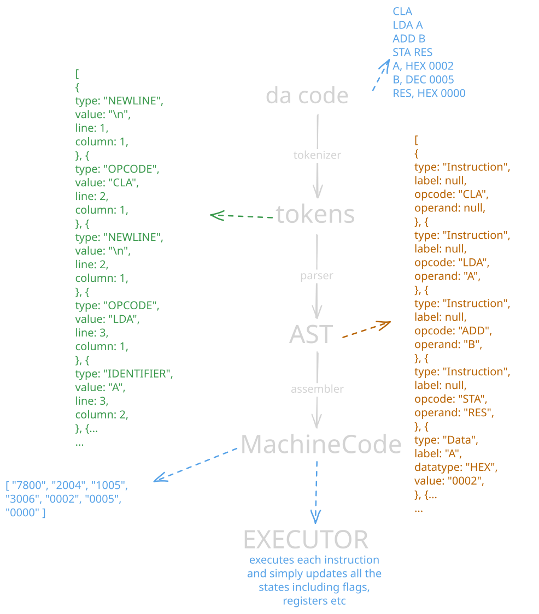
</div>

---

## The grammar of the assembly language is as follows:

```
program      → line* EOF
line         → statement NEWLINE
statement    → instruction | labelDecl
instruction  → OPCODE operand?
labelDecl    → IDENTIFIER COMMA (instruction | dataDecl)
dataDecl     → DATATYPE NUMBER
operand      → IDENTIFIER | NUMBER
```

### Dedicated to a genius, Morris Mano, the guy who made me fall in love with literal architectures, and my teacher, Prof. Zishan Noorani!
